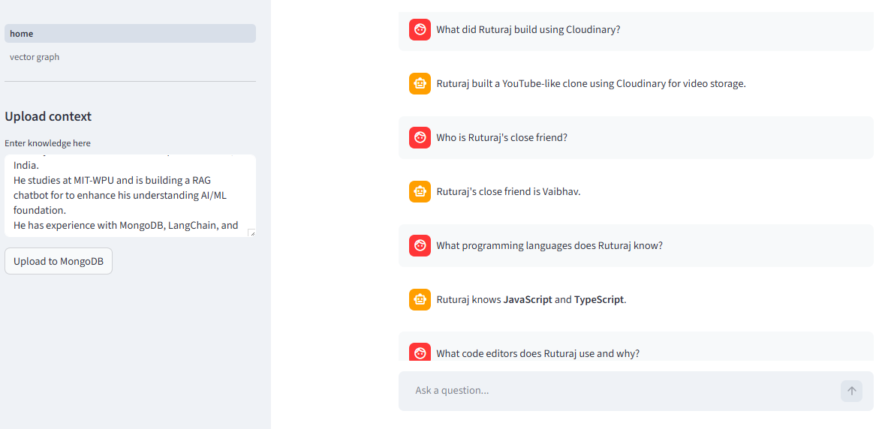
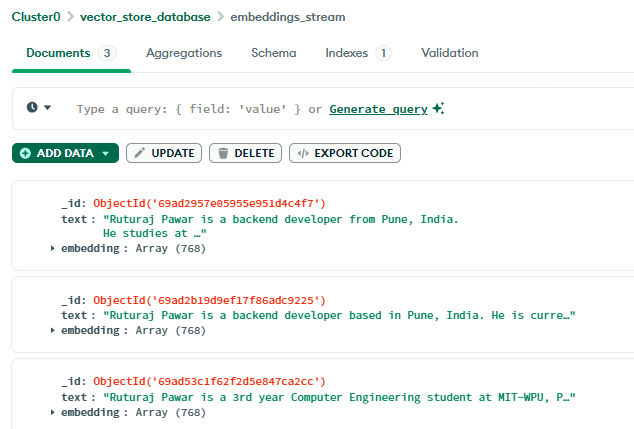
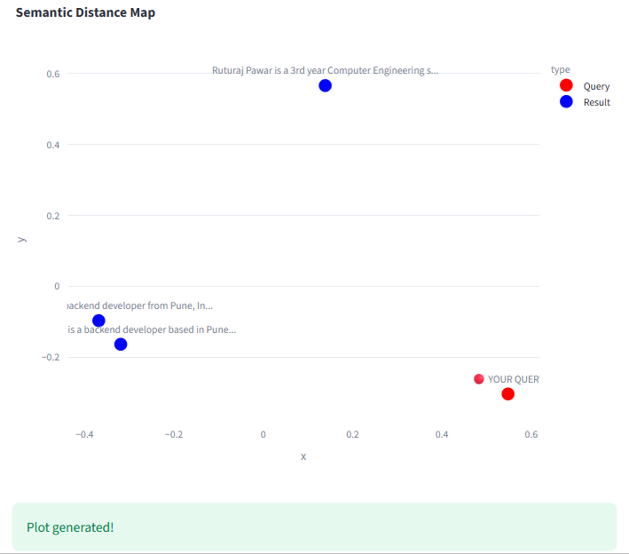

# 🤖 RAG AI Chatbot — Powered by Gemini & MongoDB Atlas

A full-stack **Retrieval-Augmented Generation (RAG)** system that lets you upload your own knowledge base and chat with it using Google Gemini. Built with LangChain, MongoDB Atlas Vector Search, and Streamlit.

---

## Screenshots

### 💬 Chatbot Homepage


### 🗄️ MongoDB Vector Data


### 📊 Semantic Distance Map (Vector Visualization)


---

## Features

- **Vector Store** — MongoDB Atlas Vector Search stores and retrieves document embeddings
- **Embeddings** — Powered by `sentence-transformers/all-mpnet-base-v2` (768 dimensions)
- **LLM** — Google Gemini `gemini-2.5-flash` for natural language responses
- **Vector Visualization** — PCA-based 2D semantic distance map using Plotly
- **Framework** — Built with LangChain + Streamlit

---

## Project Structure

```
rag_template/
├── .streamlit/
│   └── secrets.toml        # API keys (never commit this!)
├── assets/
│   ├── chatbot_homepage.png
│   ├── mongo_db_data.png
│   └── semantic_distance_map.png
├── pages/
│   └── vector_graph.py     # Vector visualization page
├── backend.py              # Core RAG logic
├── home.py                 # Streamlit chat UI
└── requirements.txt
```

---

## Prerequisites

1. Python 3.8+
2. A [MongoDB Atlas](https://www.mongodb.com/atlas) cluster with Vector Search enabled
3. A [Google AI Studio](https://aistudio.google.com) API key (Gemini)

---

## Installation

**1. Clone the repository:**
```bash
git clone <your-repo-url>
cd rag_template
```

**2. Create and activate a virtual environment:**
```bash
python -m venv venv
# Windows
venv\Scripts\activate
# macOS/Linux
source venv/bin/activate
```

**3. Install dependencies:**
```bash
pip install -r requirements.txt
```

---

## Configuration

Create a `.streamlit/secrets.toml` file in the project root:

```toml
MONGO_URI = "mongodb+srv://<username>:<password>@<cluster>.mongodb.net/?retryWrites=true&w=majority"
GEMINI_API_KEY = "your-gemini-api-key"
```

> ⚠️ Never commit `secrets.toml` to GitHub. Make sure `.gitignore` includes `.streamlit/secrets.toml`

---

## MongoDB Atlas Setup

1. Create a collection: `vector_store_database.embeddings_stream`
2. Create a **Vector Search Index** named `vector_index` with this definition:

```json
{
  "fields": [
    {
      "numDimensions": 768,
      "path": "embedding",
      "similarity": "cosine",
      "type": "vector"
    }
  ]
}
```

---

## How It Works

```
User Input Text
      ↓
HuggingFace Embeddings (768-dim vectors)
      ↓
MongoDB Atlas Vector Store
      ↓
User Query → Similarity Search (top 3 docs)
      ↓
Context + Query → Gemini LLM
      ↓
Answer + Sources
```

---

## Key Functions (`backend.py`)

| Function | Description |
|---|---|
| `get_vector_store()` | Connects to MongoDB and loads the embedding model |
| `ingest_text(text)` | Converts text to vector and stores in MongoDB |
| `get_rag_response(query)` | Retrieves top 3 similar docs and generates a Gemini answer |
| `get_vectors_for_visualization(query)` | Returns vectors for PCA plotting |

---

## Run the App

```bash
streamlit run home.py
```

Open [http://localhost:8501](http://localhost:8501) in your browser.

1. Paste your knowledge in the **sidebar** → click **Upload to MongoDB**
2. Ask questions in the **chat input**
3. Visit the **Vector Visualization** page to explore semantic similarity

---

## Tech Stack

| Tool | Purpose |
|---|---|
| [Streamlit](https://streamlit.io) | Frontend UI |
| [LangChain](https://langchain.com) | RAG pipeline orchestration |
| [MongoDB Atlas](https://www.mongodb.com/atlas) | Vector store |
| [Google Gemini](https://aistudio.google.com) | Language model |
| [HuggingFace](https://huggingface.co) | Sentence embeddings |
| [Plotly + PCA](https://plotly.com) | Vector visualization |

---

## 📄 License

MIT License